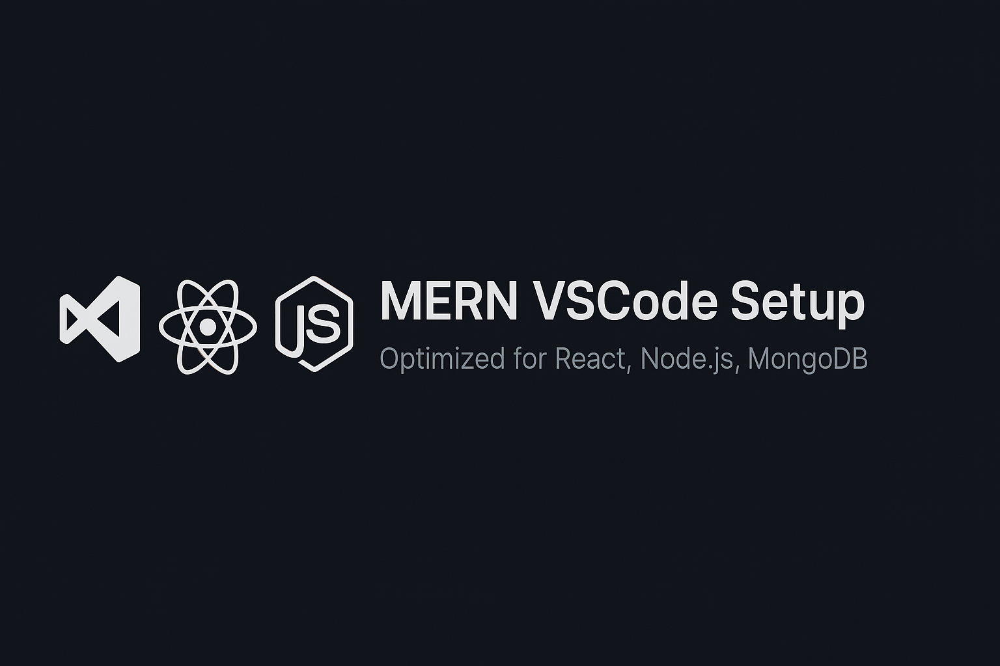

# MERN VSCode Setup 🛠️  
> ⚡ A sleek, productivity-focused VSCode setup for full-stack MERN development.  
> “Code faster, cleaner, and smarter with a VSCode setup built for MERN stack mastery.”

A curated Visual Studio Code configuration optimized for MERN stack development. This setup enhances productivity, readability, and developer experience for React, Node.js, and MongoDB workflows.

## 🔧 Features

- Prettier + ESLint integration  
- Tailwind CSS support  
- **Fira Code** font with ligatures  
- GitHub Copilot & Copilot Chat  
- React snippets and auto tag renaming  
- Postman for API testing  
- **Dark Magic Frankenstein** theme  
- **Symbols** & **Fluent Icons** for icon customization

## 📦 Recommended Extensions

See [`extensions.json`](./extensions.json) for full list.

## ⚙️ Settings Overview

Includes formatting, font, terminal, and theme preferences. See [`settings.json`](./settings.json).

## 🧠 Ideal For

- MERN stack developers  
- React frontend engineers  
- JavaScript/Node.js learners  
- Productivity-focused coders

## 🚀 Getting Started

1. Clone this repo.  
2. Copy `settings.json` and `extensions.json` into your VSCode user folder.  
3. Install recommended extensions when prompted.  
4. Enjoy your optimized coding environment!

## 💬 Feedback

Suggestions and improvements welcome via [Issues](https://github.com/hafiz-rahman/mern-vscode-setup/issues).

## 📜 License

This project is licensed under the [MIT License](https://opensource.org/licenses/MIT).

---

### 🔎 Tech Stack & Keywords

This setup is tailored for: MERN stack, VSCode configuration, React development, Node.js, MongoDB, Tailwind CSS, ESLint, Prettier, GitHub Copilot, developer productivity, frontend tools, and full-stack JavaScript workflows.